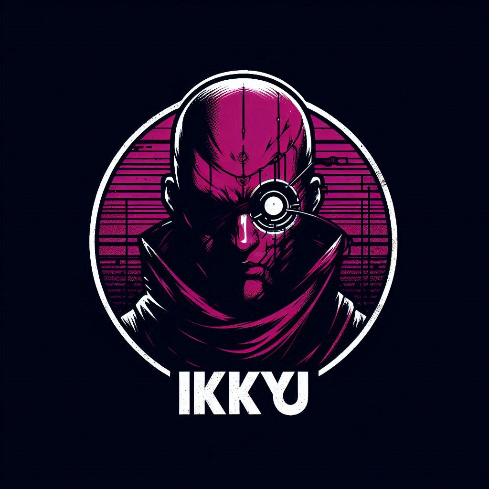
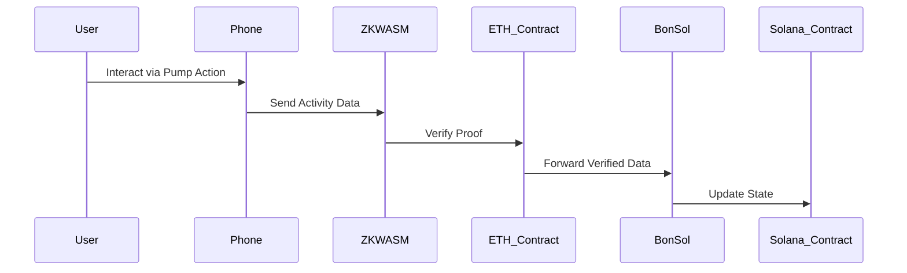
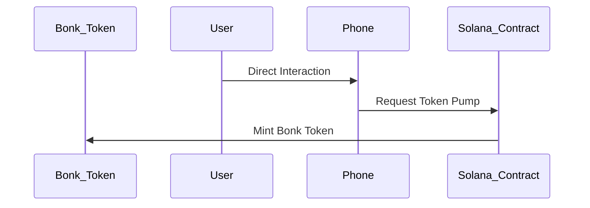

<div align="center">
<h1>Ikkyu: 行くよ</h1>

<p>A GameFi Platform: Pumping Memes into a Movement</p>

</img>

[](./LICENSE)
</div>

### Description

Ikkyu is a GameFi platform designed for meme coins, providing an innovative solution to unite communities and turn memes into movements. Forget the mundane world and embrace the path of meme enlightenment on Solana.

Our platform gamifies the process of token interaction. Users can participate by shaking their phones to create value, leveraging their smartphone's accelerometer combined with ZKWASM (Zero-Knowledge WebAssembly) for secure and verifiable interactions. 

Key features of Ikkyu include:
- **Pumping Tokens:** Retail users can purchase tokens only through a unique pumping mechanism powered by smartphone activities. This creates proof of engagement and ensures a fun, interactive process.
- **Token Issuance via Merit Points:** Users must accumulate merit points through platform activities to mint new tokens, creating a fair and rewarding ecosystem.
- **Social FOMO:** Ikkyu is designed to shine in social gatherings, enabling real-world FOMO as participants compete to pump tokens. This dynamic interaction transforms memes into a shared cultural experience, accelerating their journey into becoming a religion.

Ikkyu blends technology, fun, and spirituality to create a new paradigm for meme coins, making it easier than ever to unite communities and spread the meme gospel.

### Problem Statement

Traditional meme coin platforms often fail to foster meaningful community interactions, limiting their potential to grow into cultural phenomena. Most platforms lack mechanisms that combine fun, technology, and real-world engagement to bring users together.

### Solution

Ikkyu addresses this gap with:
1. **ZKWASM Integration:** Enabling secure gaming statements and verifiable user interactions.
2. **Cross-Chain Compatibility:** Combining Solana and EVM ecosystems for seamless user experiences.
3. **Merit-Based Token Issuance:** Encouraging meaningful participation through a gamified merit system.
4. **Real-World Engagement:** Using smartphone activities to create unique proofs, driving real-world and social interactions.

### ShowCase & What's Inside?

#### On-Chain Contract:
- Solana Devnet: [3aJpgwPr5yRnmZdfhr9yv8ptfYwyGKS6axy1DrHgCmxz](https://explorer.solana.com/address/3aJpgwPr5yRnmZdfhr9yv8ptfYwyGKS6axy1DrHgCmxz?cluster=devnet)
- Bonsol Image ID: fa70b97511d738bcb827176ce20033758bc2ef64ab05271fa6590c5e5bb0a4e8
- Bonsol Deployed Issue: https://github.com/anagrambuild/bonsol/issues/108

#### Turborepo Structure:
- **ZKWASM Module:** `packages/zkwasm` – Implements zero-knowledge proofs for gaming.
- **PWA Gaming App:** `apps/pwa` – Progressive Web App for seamless gameplay.
- **Backend for Counting Points:** `apps/serverless` – Serverless backend to track and verify user progress.
### Build Steps

1. frontend and serverless
```bash
bun i 
bun run build # build all apps & packages
bun run dev
```

2. contracts
```bash
anchor build
bun run deploy
```
Ikkyu isn’t just a platform—it’s a movement, a culture, and a tool for meme enthusiasts to thrive in the decentralized economy. Let’s pump, play, and make history together!

### Flow Chart


